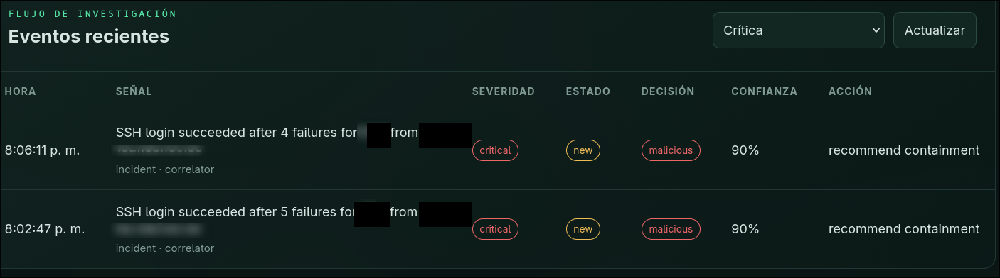
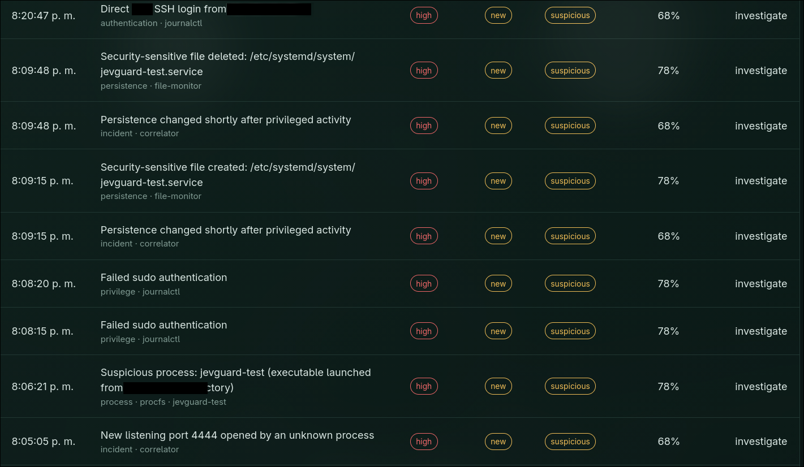
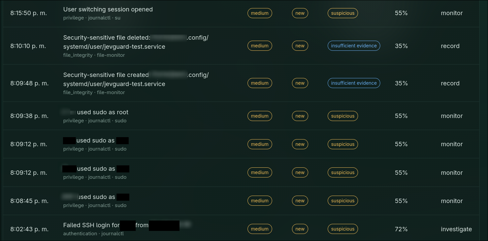
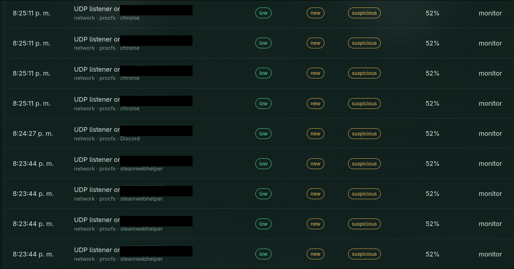

# JevGuard Linux SIEM

JevGuard is a small, open-source SIEM for monitoring one Linux host. It collects local security telemetry, applies deterministic correlation rules, stores the evidence in SQLite, and optionally uses Jev through OpenRouter for bounded triage decisions.

The project is designed to run as an unprivileged local service. It does not block addresses, kill processes, change firewall rules, or execute containment actions automatically.

## What it detects

- SSH authentication failures, successful logins, brute-force patterns, and a successful login after failures.
- Direct SSH logins as `root`, `sudo` failures and commands, `su` sessions, account-management activity, and process crashes reported by systemd-coredump.
- TCP and UDP sockets enriched with PID, user, executable, and command line when `/proc` permissions allow it.
- New listeners, suspicious listeners, firewall drops from the kernel journal, and possible port scans.
- Changes to sensitive files, cron and systemd persistence, user autostart files, accounts, privileged groups, and suspicious processes.
- Optional auditd events for short-lived process execution and access-control denials.

Low-risk telemetry remains visible in the dashboard and is classified locally. Human review is reserved for high or critical events, malicious classifications, or explicit investigation and containment recommendations.

## Screenshots

<p align="center">
  
  
</p>
<p align="center">
  
  
</p>

The screenshots are redacted examples from a Linux test host. They are included as portfolio material and are not required to run the application.

## Requirements

- Linux with Python 3.11 or newer.
- `journalctl` for journal-based telemetry.
- Read access to the relevant journal entries.
- Optional: `auditd` and read access to `/var/log/audit/audit.log` for complete process-execution coverage.

JevGuard works without an AI key. In that mode all decisions use the local deterministic provider.

## Installation

```bash
git clone <YOUR_REPOSITORY_URL>
cd jevguard-siem
python3 -m venv .venv
source .venv/bin/activate
python -m pip install --upgrade pip
python -m pip install -e '.[dev]'
```

Run the test suite:

```bash
pytest -q
```

## First run without AI

```bash
cp .env.example .env
jevguard seed-demo
jevguard serve
```

Open <http://127.0.0.1:8000>. The default bind address is loopback. Keep it there unless you add an authentication and network-access layer in front of the dashboard.

Collect one host snapshot without starting the web server:

```bash
jevguard collect-once
```

## OpenRouter and Jev

Create `.env` from `.env.example` and configure:

```env
JEVGUARD_AI_PROVIDER=openrouter
OPENROUTER_API_KEY=your-key
OPENROUTER_MODEL=~typesafe/jev-latest
```

Test the configured provider with one synthetic event:

```bash
jevguard test-ai
```

JevGuard sends only high and critical events to an external provider by default. Informational, low, and ordinary medium events stay local. The default limits are:

```env
JEVGUARD_AI_MAX_PER_HOUR=10
JEVGUARD_AI_MAX_PER_DAY=100
JEVGUARD_AI_COOLDOWN_SECONDS=3600
JEVGUARD_AI_MIN_SEVERITY=high
```

Raw journal messages, commands, command lines, and fields that look like credentials are redacted from the external copy. The original evidence remains in the local SQLite database. OpenRouter Jev usage and cost are shown in the dashboard when the provider returns usage metadata.

Other OpenRouter models can use the OpenAI-compatible adapter:

```env
JEVGUARD_AI_PROVIDER=openrouter
OPENROUTER_API_KEY=your-key
OPENROUTER_MODEL=provider/model-name
```

For another compatible service, use `JEVGUARD_AI_PROVIDER=openai-compatible` with `AI_BASE_URL`, `AI_MODEL`, and optionally `AI_API_KEY`. Remote URLs must use HTTPS; plain HTTP is accepted only for localhost model servers.

## Listener allowlist

Known listeners can remain in local telemetry without opening a new-listener incident. Configure entries as `protocol:port:process-glob`:

```env
JEVGUARD_ALLOWED_LISTENERS=tcp:22:sshd,udp:53:*,udp:5353:*
```

Allowlisting reduces noise and external decisions; it does not delete evidence.

## Optional auditd coverage

The dashboard remains unprivileged. Review the starter policy before installing it as an administrator:

```text
config/jevguard-audit.rules
```

The collector reads auditd data only when the current user has permission. Without auditd, `/proc` polling can miss very short-lived processes.

## Testing the detections

Run controlled tests only against a host you own or are explicitly authorized to test. Useful checks include three failed SSH passwords followed by a successful login, a temporary listener on port 4444, a harmless executable launched from `/tmp`, a failed `sudo`, and a temporary systemd unit that is removed after the collector records it. The resulting events and correlations are visible in the dashboard.

## Architecture

```text
Linux journal / procfs / auditd / files
                  │
                  ▼
             Collectors
                  │
                  ▼
       Normalized SecurityEvent
                  │
        deterministic correlation
             │              │
             ▼              ▼
       SQLite storage   bounded AI triage
             │              │
             └──────┬───────┘
                    ▼
              Local dashboard
```

Collectors are read-only. The provider interface supports local rules, Jev, OpenRouter, and generic OpenAI-compatible services without changing storage or collection code.

## Known limitations

- This is a single-host SIEM, not a centralized log platform.
- Packet payloads, DNS content, and full container-runtime telemetry are not inspected.
- `/proc` polling can miss short-lived processes; auditd is needed for stronger execution coverage.
- Journal, process, and audit visibility depends on Linux permissions and distribution configuration.
- The dashboard is intended for loopback access and has no built-in user authentication.
- AI output is advisory. Local policy preserves deterministic high and critical risk floors and never performs containment automatically.

See [the product plan](docs/PLAN.md), [the threat model](docs/THREAT_MODEL.md), and [the contribution guide](CONTRIBUTING.md).

## License

JevGuard is released under the [MIT License](LICENSE).
